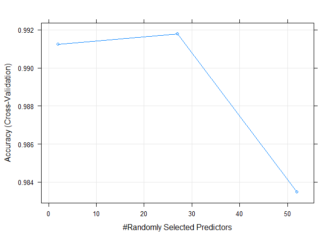

## Synopsis

In this project, the data is collected from certain users who perform an excercise in five different ways in which 1 way is the proper way of performing the excercise. There are mainly two datasets one for training and the other for testing. The training dataset is used for training a model and use the trained model to find the method in which the user performed the excercise in the test dataset. The training data is splitted into 2 sets for performing cross-validation analysis. The training set is used to train the model and the validation set is then used for finding the accuracy of the model. The trained model is then used finally to find the type of excercise that is being performed by the person. It is also found that the accuracy of the model is more than 99% and also the classe variable of the test dataset is found perfectly.

## Package and Datasets Loading

The two sets that are required for this project are loaded into the program as the training and test datasets. All the packages that are required for performing this machine learning project are also loaded into the program. 


```r
library(caret)
library(dplyr)
library(parallel)
library(doParallel)
library(rattle)
library(corrplot)
```

```
## corrplot 0.84 loaded
```

```r
train_set = read.csv("pml-training.csv")
test_set = read.csv("pml-testing.csv")
```

## Removal of unnecessary columns

Since, most of the columns in the test dataset contains many 'NA' values the columns with more than a large number of NA values in the test dataset is found and as these columns does not affect the "classe" variable very much these columns are removed from both the training and test datatsets. 


```r
col_names_testna = colnames(test_set)[colSums(is.na(test_set)) > 15]
new_test_set = select(test_set, -all_of(col_names_testna))
new_train_set = select(train_set, -all_of(col_names_testna))
```

## Creation of Validation Dataset

In order to find the accuracy of the trained model on the training dataset, the training set is divided into 2 sets for performing cross-validation analysis. One set is the training set for training the model and the other set is the validation set for performing cross-validation. 


```r
row_numbers = createDataPartition(y = train_set$classe, p = 0.75, list = FALSE)
training_set = new_train_set[row_numbers, ]
validation_set = new_train_set[-row_numbers, ]
```

## Dataset Filtering

The next step is performed for finding out the variables that affects the training model very much. So, the variables of the training dataset with zero (or) near-zero variance is found and those columns are removed from all the 3 datasets. Also, the columns that does not affect the 'classe' variable is also found and removed.


```r
set.seed(3222)
column_numbers = nearZeroVar(training_set)
training_set_reqd = training_set[, -column_numbers]
validation_set_reqd = validation_set[, -column_numbers]
new_test_set = new_test_set[, -column_numbers]
non_reqd_no = 1:6
training_set_reqd = training_set_reqd[, -non_reqd_no]
validation_set_reqd = validation_set_reqd[, -non_reqd_no]
new_test_set = new_test_set[, -non_reqd_no]
```

The next step of omitting the rows containing the 'NA' values are removed so as to perform the training operation for the model flawlessly.


```r
training_set_reqd = na.omit(training_set_reqd)
validation_set_reqd = na.omit(validation_set_reqd)
new_test_set = na.omit(new_test_set)
```

## Correlation between Dataset variables


```r
col_no_train = ncol(training_set_reqd)
correlation = cor(training_set_reqd[, -col_no_train])
corrplot(correlation, order = "FPC", method = "color", type = "upper", 
         tl.cex = 0.8, tl.col = rgb(0, 0, 0))
```

<!-- -->

The points in the plot with the dark color shows higher correlation than the ones with the light colors. 

## Model Training and Prediction

This is the very important step of the machine learning process, i.e., the model training. For this process, the **"Random Forest"** method is selected for performing the training function and this step is performed by parallel computation to reduce the amount of time required for performing the operation. The trained model is then saved into a new variable which is then used for predicting the values for other dataset.  
The next step is the step of prediction. The fitted model is now used with the predict function and in this step the predict function is used with the validation dataset to perform cross-validation analysis.  


```r
cluster <- makeCluster(detectCores() - 1) # convention to leave 1 core for OS
registerDoParallel(cluster)
fitControl <- trainControl(method = "cv",
                           number = 5,
                           allowParallel = TRUE)
col_no_valid = ncol(validation_set_reqd)
fit = train(classe ~ ., method = "rf", data = training_set_reqd, verbose = FALSE, trControl = fitControl)
predicted_values_valid = predict(fit, newdata = validation_set_reqd[, -col_no_valid])
fit
```

```
## Random Forest 
## 
## 14718 samples
##    52 predictor
##     5 classes: 'A', 'B', 'C', 'D', 'E' 
## 
## No pre-processing
## Resampling: Cross-Validated (5 fold) 
## Summary of sample sizes: 11775, 11774, 11775, 11774, 11774 
## Resampling results across tuning parameters:
## 
##   mtry  Accuracy   Kappa    
##    2    0.9912351  0.9889114
##   27    0.9917789  0.9895997
##   52    0.9834894  0.9791102
## 
## Accuracy was used to select the optimal model using the largest value.
## The final value used for the model was mtry = 27.
```

```r
plot(fit)
```

<!-- -->

Now, the predicted values are checked with the values present in the validation set to find the accuracy of the trained model.  


```r
cfmat = confusionMatrix(predicted_values_valid, validation_set_reqd[, "classe"])
cfmat
```

```
## Confusion Matrix and Statistics
## 
##           Reference
## Prediction    A    B    C    D    E
##          A 1394    6    0    0    0
##          B    1  943    5    0    0
##          C    0    0  846    3    3
##          D    0    0    4  801    1
##          E    0    0    0    0  897
## 
## Overall Statistics
##                                         
##                Accuracy : 0.9953        
##                  95% CI : (0.993, 0.997)
##     No Information Rate : 0.2845        
##     P-Value [Acc > NIR] : < 2.2e-16     
##                                         
##                   Kappa : 0.9941        
##                                         
##  Mcnemar's Test P-Value : NA            
## 
## Statistics by Class:
## 
##                      Class: A Class: B Class: C Class: D Class: E
## Sensitivity            0.9993   0.9937   0.9895   0.9963   0.9956
## Specificity            0.9983   0.9985   0.9985   0.9988   1.0000
## Pos Pred Value         0.9957   0.9937   0.9930   0.9938   1.0000
## Neg Pred Value         0.9997   0.9985   0.9978   0.9993   0.9990
## Prevalence             0.2845   0.1935   0.1743   0.1639   0.1837
## Detection Rate         0.2843   0.1923   0.1725   0.1633   0.1829
## Detection Prevalence   0.2855   0.1935   0.1737   0.1644   0.1829
## Balanced Accuracy      0.9988   0.9961   0.9940   0.9975   0.9978
```

```r
plot(cfmat$table, col = cfmat$byClass, main = paste("Random Forest Confusion Matrix: Accuracy =", round(cfmat$overall['Accuracy'], 4)))
```

<!-- -->

It is found that the accuracy of the trained model is more than 0.9953 which implies that the out of sample error is very less i.e., 0.0047.   

## Test Values Prediction

The final step of the project of predicting the method by which the person did the excercise is found by using the trained model.  


```r
col_no_test = ncol(new_test_set)
predicted_values_test = predict(fit, newdata = new_test_set[, -col_no_test])
print(predicted_values_test)
```

```
##  [1] B A B A A E D B A A B C B A E E A B B B
## Levels: A B C D E
```

```r
stopCluster(cluster)
registerDoSEQ()
```

## Assumptions

The following are the assumptions made while performing the project.  
* The columns of the test dataset that contains more number of NA values does not affect the classe variable as those coulumns could not be used for prediction purposes.  
* The columns of the train dataset that has zero (or) non-zero variance does not affect the train model.  
* The first few rows of the dataset does not affect the train model as they represent information about the person performing the excercise and the time in which they perform the excercise.

## Conclusion

The trained model is very accurate for predicting the results and the the prediction of the test dataset proved to be exact. 
